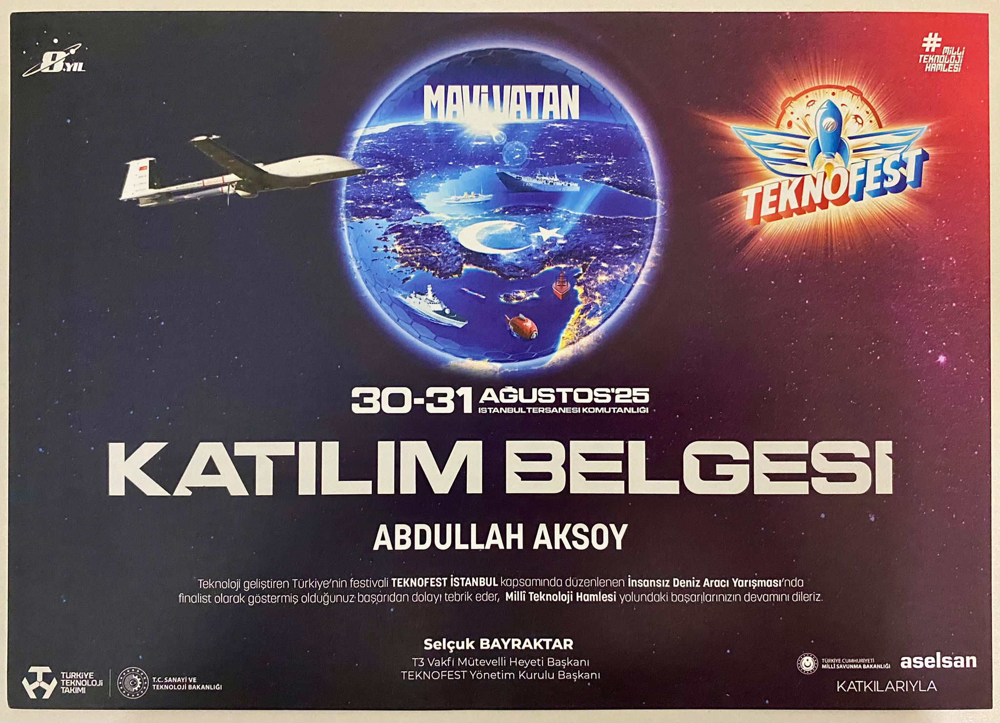

# 🎓 Sertifikalarım 

> 📚 Bu repository, profesyonel gelişimim sürecinde tamamladığım eğitimlerin ve aldığım sertifikaların koleksiyonunu içermektedir. Her sertifika, sürekli öğrenme ve kendimi geliştirmeye olan bağlılığımı temsil etmektedir.

---

## 📋 İçindekiler | Table of Contents

- [🤖 Yapay Zeka & Veri Bilimi](#-yapay-zeka--veri-bilimi)
- [💻 Yazılım Geliştirme](#-yazılım-geliştirme)
- [🐍 Python Programlama](#-python-programlama)
- [📊 Proje Yönetimi](#-proje-yönetimi)
- [🔧 Geliştirici Araçları](#-geliştirici-araçları)
- [📈 İstatistikler](#-i̇statistikler)

---

## 🎯 Sertifika Kategorileri | Certificate Categories

### 🤖 Yapay Zeka & Veri Bilimi

| Kurum                                                                                                                                                                                             | Eğitim Adı | Sertifika | Durum |
| -------------------------------------------------------------------------------------------------------------------------------------------------------------------------------------------------- | ---------- | --------- | ----- |
|  | Veri Bilimi Bootcamp | [📄 Görüntüle](docs/veribilimi.pdf) | ✅ Tamamlandı |

### 💻 Yazılım Geliştirme

| Kurum                                                                                               | Eğitim Adı                          | Sertifika                               | Durum         |
| --------------------------------------------------------------------------------------------------- | ----------------------------------- | --------------------------------------- | ------------- |
|  | Girişimcilik                        | [📄 Görüntüle](docs/01800779706071.pdf) | ✅ Tamamlandı |
|  | Web Uygulamaları Geliştirme Eğitimi | [📄 Görüntüle](docs/37352087001693.pdf) | ✅ Tamamlandı |

### 🐍 Python Programlama

| Kurum                                                                                                   | Eğitim Adı                | Sertifika                        | Durum         |
| ------------------------------------------------------------------------------------------------------- | ------------------------- | -------------------------------- | ------------- |
|  | Python 101 - Temel Seviye | [📄 Görüntüle](docs/python1.pdf) | ✅ Tamamlandı |
|  | Python 201 - Orta Seviye  | [📄 Görüntüle](docs/python2.pdf) | ✅ Tamamlandı |
|  | Python 301 - İleri Seviye | [📄 Görüntüle](docs/python3.pdf) | ✅ Tamamlandı |

### 📊 Proje Yönetimi

| Kurum                                                                                               | Eğitim Adı     | Sertifika                             | Durum         |
| --------------------------------------------------------------------------------------------------- | -------------- | ------------------------------------- | ------------- |
|  | Proje Yönetimi | [📄 Görüntüle](docs/PDF.jsviewer.pdf) | ✅ Tamamlandı |

### 🔧 Geliştirici Araçları

| Kurum                                                                                                | Eğitim Adı   | Sertifika                                                              | Durum         |
| ---------------------------------------------------------------------------------------------------- | ------------ | ---------------------------------------------------------------------- | ------------- |
|  | Git & GitHub | [📄 Görüntüle](docs/Versiyon_Kontrolleri__Git_ve_GitHub_Sertifika.pdf) | ✅ Tamamlandı |

---

![Teknofest]

